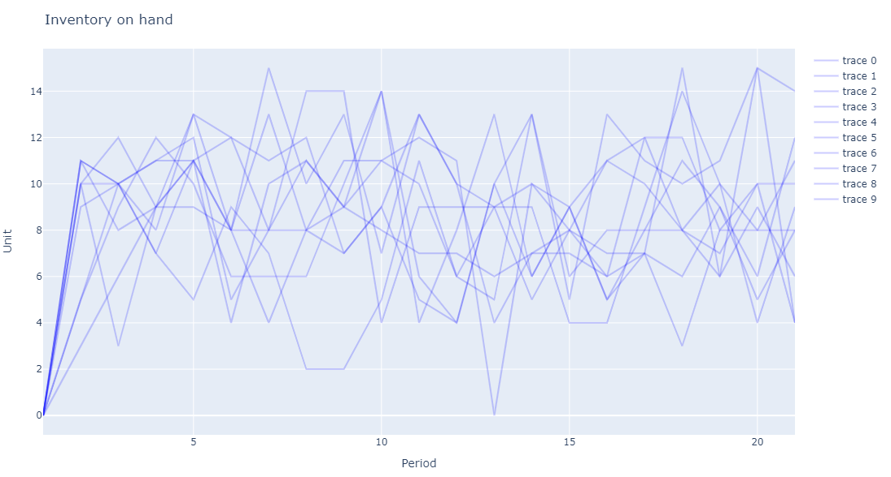

# SupplyChainSimulation	

SupplyChainSimulation is a package to model and simulate supply chains.

The simulation is built around a loop that keeps track of orders and inventory movements:

- receive_inventory
- place_orders
- receive_orders
- send_inventory

Each step can be customized by applying different policies. The policies can also be optimized to improve the supply chain performance.

## Installation

SupplyChainSimulation can be installed using the Julia package manager.
From the Julia REPL, type `]` to enter the Pkg REPL mode and run

```
pkg> add SupplyChainSimulation
```

## Getting Started

The first step to use SupplyChainSimulation is to define the supply chain. This is done by specifying the supply chain network, including product, suppliers, storage locations, and customers.

In the example below we define a network with one product, one supplier, one storage location, and one customer.

```julia
horizon = 20
  
product = Single("product")

supplier = Supplier("supplier")
storage = Storage("storage", Dict(product => 1.0))
customer = Customer("customer")

l1 = Lane(; origin = storage, destination = customer)
l2 = Lane(; origin = supplier, destination = storage)

network = Network([supplier], [storage], [customer], get_trips([l1, l2], horizon), [product])
```

The second step is to define the starting state. The initial state represents the inventory situation at the start of the simulation: what inventory is on hand, what inventory is in transit. The state also has information about the future: what demand we expect and what policies we want to use when computing orders. More than one initial state can be defined to represent potential different situations that have to be simulated or optimized. For example we could have several demand scenarios. In our example, we will create 10 such scenarios with different demand from the customer. In the example we use an order up to policy that will place an order to replenish the inventory back to a given value.

```julia
policy = OnHandUptoOrderingPolicy(0)

initial_states = [State(; on_hand_inventory = Dict(storage => Dict(product => 0)), 
                        demand = Dict((customer, product) => rand(Poisson(10), horizon)),
                        policies = Dict((l2, product) => policy)) for i in 1:10]
```

The third step is to run the simulation or the optimization (depending on whether you already know the policies you want to use or whether you want to find the best policies). In our example we will search the best policy by running the optimizer.

```julia
optimize!(network, horizon, initial_states...)
final_states = [simulate(network, horizon, initial_state) for initial_state in initial_states]

```

The final step is to analyze the results. There are various function we can call to get information such as the orders that have been placed, the inventory on hand at any time, and more. There are also plotting functions which provide the information in a graphical way. In our example we will plot the amount of inventory at the storage location over time.

```julia
plot_inventory_onhand(final_states, storage, product)
```

The resulting plot is shown below.



## Policies

The package comes with several policies predefined, including:

- QuantityOrderingPolicy: Orders a given quantity specific to each time period. The quantity ordered is the same across scenarios and irrespective of the current inventory position.
- OnHandUptoOrderingPolicy: Orders up to a given number based on the number of units on hand; no matter what is on order.
- NetUptoOrderingPolicy: Orders up to a given number based on the net number of units (on hand + in transit + on order - on backlog).
- NetSSOrderingPolicy: Orders up to a given number based on the net number of units (on hand + in transit + on order - on backlog) if the net inventory is below a threshold.

## Creating a new policy

Creating a new policy is easy and can be done in two steps:

1. Create a new struct to represent your policy. This struct can hold the data you need to compute the orders. For example, let's say that we want to create a policy that orders always the same amount. We will create the following strut

```julia
mutable struct SameOrderPolicy <: InventoryOrderingPolicy
    order::Int64
end
```

2. Implement the following functions:

```julia
function get_parameter_count(policy::SameOrderPolicy)
    return 1 # indicates how many parameters the policy has so that the optimizer can optimize the policy.
end

function set_parameter!(policy::SameOrderPolicy, values::Array{Float64, 1})
    policy.order = Int.(round.(values[1])) # sets the value of the order to the value provided by the optimizer
end

function get_order(policy::SameOrderPolicy, state, env, location, lane, product, time)
    return policy.order # returns the order when running the policy during a simulation
end
```

Once the policy is defined it can be used either as part of a simulation run where the order is defined by you, or as part of an optimization run where the optimizer will find the best order to minimize the cost function.

## API

```@autodocs
Modules = [SupplyChainSimulation]
Order   = [:type, :function]
```
